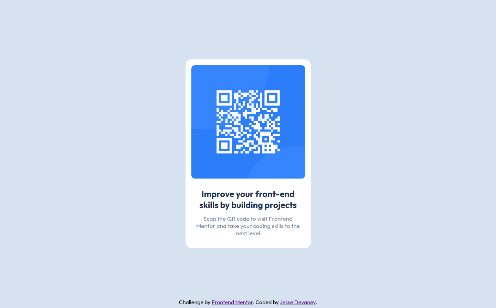

# Frontend Mentor - QR code component solution

This is a solution to the [QR code component challenge on Frontend Mentor](https://www.frontendmentor.io/challenges/qr-code-component-iux_sIO_H). Frontend Mentor challenges help you improve your coding skills by building realistic projects.

## Table of contents

- [Frontend Mentor - QR code component solution](#frontend-mentor---qr-code-component-solution)
  - [Table of contents](#table-of-contents)
  - [Overview](#overview)
    - [Screenshots](#screenshots)
      - [Desktop View](#desktop-view)
      - [Mobile View](#mobile-view)
    - [Links](#links)
  - [My process](#my-process)
    - [Built with](#built-with)
  - [Author](#author)

## Overview

### Screenshots

#### Desktop View

#### Mobile View

### Links

- Live Site URL: [QR Code Component](https://jessesdevaney.github.io/front-end-mentor/qr-code-component-main/)

## My process

### Built with

- HTML
- CSS
- React
- Vite

## Author

- Website - [Jesse Devaney](https://www.github.com/jessesdevaney)
- Frontend Mentor - [@JesseSDevaney](https://www.frontendmentor.io/profile/JesseSDevaney)
